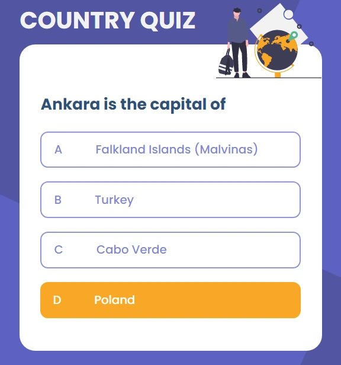
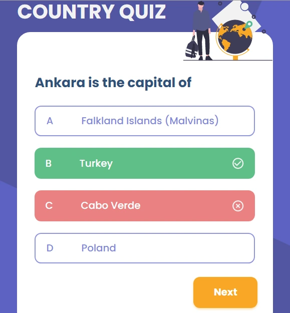
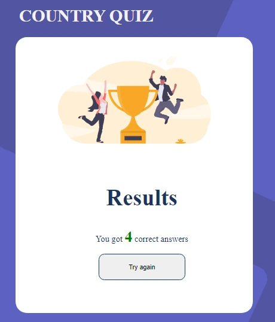
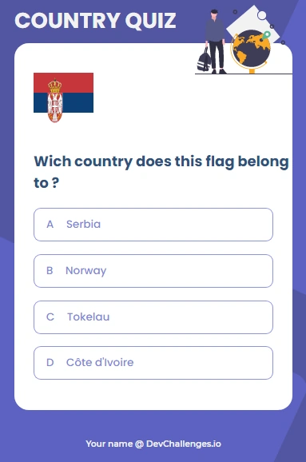

<h1 align="center">Country Quiz</h1>

<div align="center">
  <h3>
    <a href="https://github.com/Betsimisaraka/country-quiz">
      Demo
    </a>
    <span> | </span>
    <a href="https://country-quiz-betsimisaraka.netlify.app/">
      Solution
    </a>
  </h3>
</div>

In this project our challenge was to create a country quiz app using an API, and use React to handle the frontend.

## Overview






-   My demo

You can see my demo by clicking this github link with the username [Betsimisaraka](https://github.com/Betsimisaraka/country-quiz)

- My experience

I had quite lots of experience while doing this project: 

1. fetching the data from the api

1. displaying the questions and the answers randomly.

1. Check if the answer is correct or not and changing their background.

1. Showing the score in the result page.

-   What have you learned/improved?

1. I have learned how can I display questions randomly and the answers by fetchin from the `API`.

1. When the users got the answer wrong stop the quiz and ask them to try again and showing thier score in the second page.


### Built With

-   [React](https://reactjs.org/)
-   [Html](https://html.org/)
-   [Css](https://css.org)

## Features

These are the user stories that I had to fulfilled:
- I can see at least 2 types of question: a city is the capital of.. or a flag belong to country..
- I can see select an answer
- I can see if my answer is correct or incorrect
- When I answer correctly, I can move on to the next question
- When I answer incorrectly, I can see my results and try again
- I can try again

## How To Use

<!-- Example: -->

To clone and run this application, you'll need [Git](https://git-scm.com) and [Node.js](https://nodejs.org/en/download/) (which comes with [npm](http://npmjs.com)) installed on your computer. From your command line:

```bash
# Clone this repository
$ git clone https://github.com/Betsimisaraka/country-quiz

# Install dependencies
$ npm install react react-dom

# Run the app
$ npm start
$ parcel index.html
```


## Contact

-   GitHub [Betsimisaraka](https://{github.com/Betsimisaraka})

**API**: https://restcountries.eu/. Use data from the API to create questions and answers.

**Live app** : https://country-quiz-app.netlify.app/


