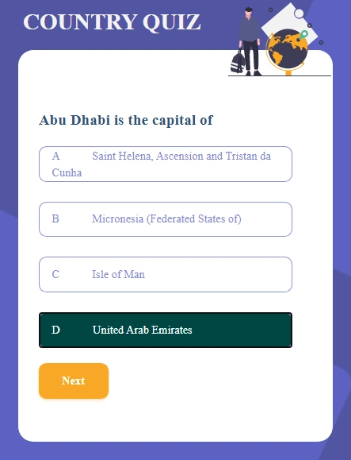

# Country Quiz

Challenge: Create a country quiz app using an API, and use React to handle the frontend. Don’t look at the existing solution. Fulfill user stories below:


-   User story: I can see at least 2 types of question: a city is the capital of.. or a flag belong to country..
-   User story: I can see select an answer
-   User story: I can see if my answer is correct or incorrect
-   User story: When I answer correctly, I can move on to the next question
-   User story: When I answer incorrectly, I can see my results and try again
-   User story: I can try again

**Icon**: https://google.github.io/material-design-icons/

**API**: https://restcountries.eu/. Use data from the API to create questions and answers.

**Design** : https://www.figma.com/file/Gw0ZNBbYN8asqFlZWy3jG1

**Live app** : https://country-quiz-app.netlify.app/

As long as you fulfill all the user stories, you can give your personal touches by adding transition, using your own images, changing colors, or even creating your own layout,...

Once you completed, submit your solutions by providing URLs for both GitHub repository and live app on Netlify and explain briefly what you have done.

For the custom domain url you'll enter in netlify, please use the following naming convention : **country-quiz-_YOUR_FIRSTNAME_.netlify.app** (replace YOUR_FIRSTNAME by your firstname)

Good luck everybody!

Template for your readme :

<!-- Please update value in the {}  -->

<h1 align="center">Country Quiz</h1>

<div align="center">
  <h3>
    <a href=" https://github.com/Betsimisaraka/country-quiz">
      Demo
    </a>
    <span> | </span>
    <a href=" https://country-quiz-betsimisaraka.netlify.app/">
      Solution
    </a>
  </h3>
</div>

<!-- TABLE OF CONTENTS -->

## Table of Contents

-   [Overview](#overview)
    -   [Built With](#built-with)
-   [Features](#features)
-   [How to use](#how-to-use)
-   [Contact](#contact)
-   [Acknowledgements](#acknowledgements)

<!-- OVERVIEW -->

## Overview





Introduce your projects by taking a screenshot or a gif. Try to tell visitors a story about your project by answering:

-   Where can I see your demo?

You can see my demo in the github link above with the username `Betsimisaraka`
-   What was your experience?

I had a lots of experience while doing this project: 

1. fetching the data from the api

1. displaying the questions and the answers randomly.

1. Check if the answer is correct or not and changing their background.

1. Showing the score in the result page.

-   What have you learned/improved?

1. I have learned how can I display questions randomly and the answers by fetchin from the `API`.

1. When the users got the answer wrong stop the quiz and ask them to try again and showing thier score in the second page.
-   Your wisdom? :)

### Built With

<!-- This section should list any major frameworks that you built your project using. Here are a few examples.-->

-   [React](https://reactjs.org/)
-   [Html](https://html.org/)
-   [Css](https://css.org)

## Features

<!-- List the features of your application or follow the template. Don't share the figma file here :) -->

## How To Use

<!-- Example: -->

To clone and run this application, you'll need [Git](https://git-scm.com) and [Node.js](https://nodejs.org/en/download/) (which comes with [npm](http://npmjs.com)) installed on your computer. From your command line:

```bash
# Clone this repository
$ git clone https://github.com/Betsimisaraka/country-quiz

# Install dependencies
$ npm install react react-dom

# Run the app
$ npm start
$ parcel index.html
```

## Acknowledgements

<!-- This section should list any articles or add-ons/plugins that helps you to complete the project. This is optional but it will help you in the future. For example: -->

## Contact

-   Website [your-website.com](https://{your-web-site-link})
-   GitHub [@your-username](https://{github.com/Betsimisaraka})
-   Twitter [@your-twitter](https://{twitter.com/your-username})
